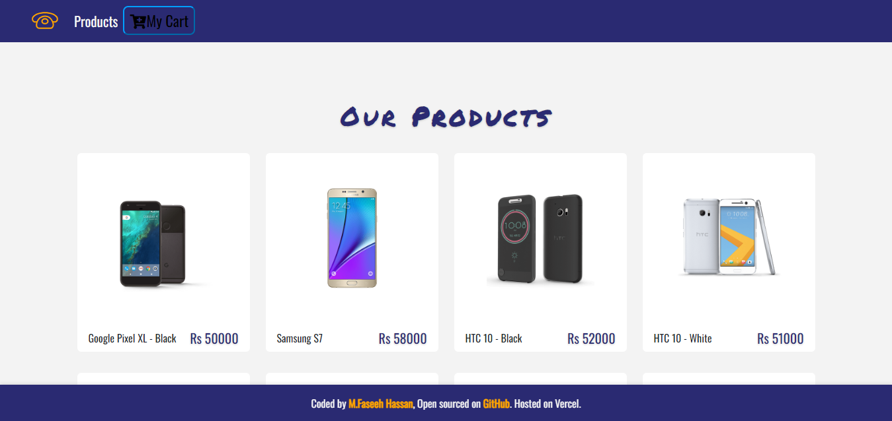

# E-Commerce Application

This is a web app developed as an internship project for VerveBridge, using React.js and Bootstrap. It allows users to browse products, manage a shopping cart, and proceed to checkout. The app is designed to provide a seamless shopping experience with a professional, responsive interface.

<h2 align="center">
  <a href="https://react-e-commerce-faseeh.vercel.app/" target="_blank">React-E-Commerce-Faseeh.vercel.app</a>
</h2>

  
  

# Features

- Shopping Cart: Users can add products to their cart and view the cart contents.
- Responsive Design: The app is built using Bootstrap to ensure a professional, mobile-friendly design.
- Getting Data Static and image are add of Products along Pricing.

# Technologies & Tools Used

- React.js
- HTML
- BootStrap
- CSS
- JavaScript
- VS Code

# Installation and Usage

To use this app, you can follow these steps:

- Clone the repository or download the source code.
- Open the project in your preferred code editor.
- Run npm install to install the necessary dependencies.
- Run npm start to start the development server.
- Open your browser and navigate to http://localhost:3000 to use the app.

To use the app, simply start a quiz, answer the questions, and view your results at the end.

# Demo

A live demo of the React Quiz App is available at LINK TO LIVE DEMO.

# Credits

The Quiz App was created by M. Faseeh Hassan as an internship task for VerveBridge during a React workshop.

### Show your support

Give a ⭐ if you like this website!
